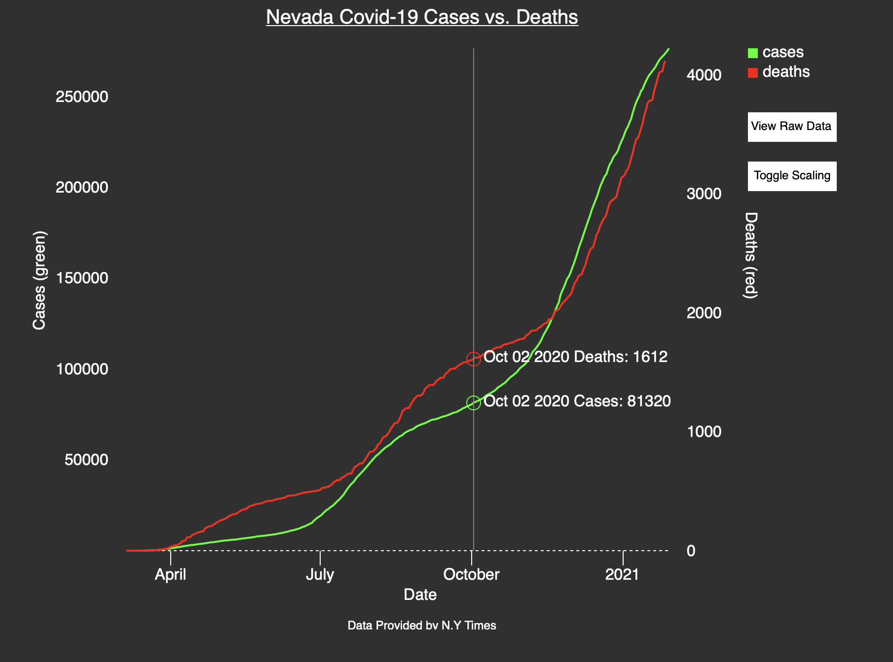

## Simple Graph of Nevada Covid-19 Cases vs Deaths

This was a simple and quick exercise utilizing D3 v3 to view continuously updating Covid-19 data in Nevada.

Data and counts are displayed using linear interpolation between actual data points.

Data Source: The New York Times

Citation:
"The New York Times. (2021). Coronavirus (Covid-19) Data in the United States. Retrieved from https://github.com/nytimes/covid-19-data."